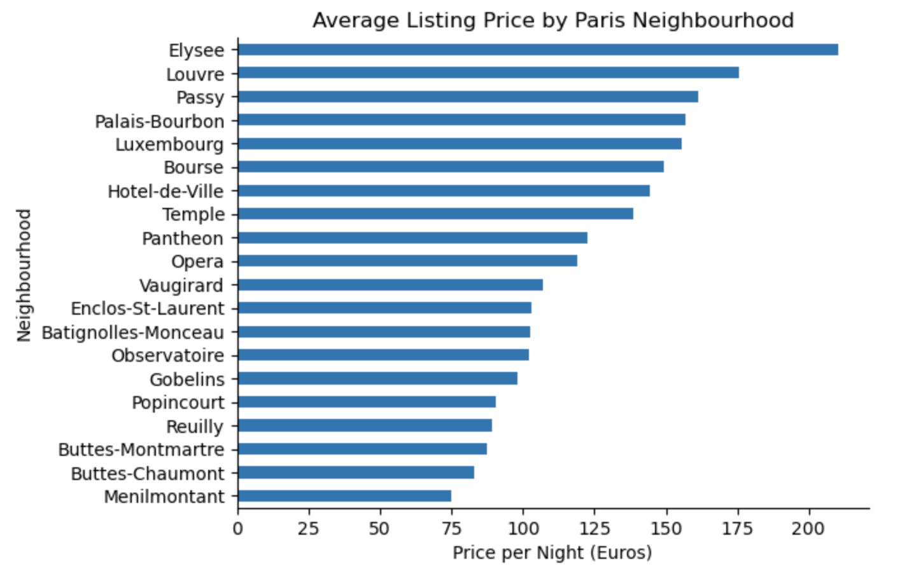
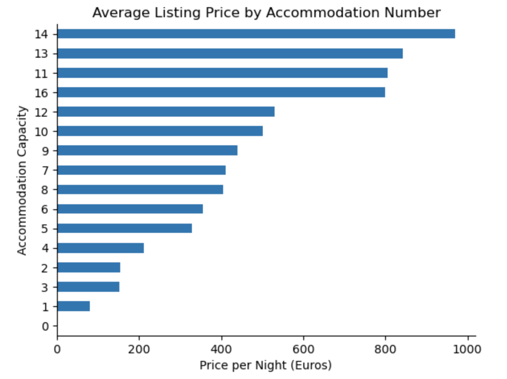
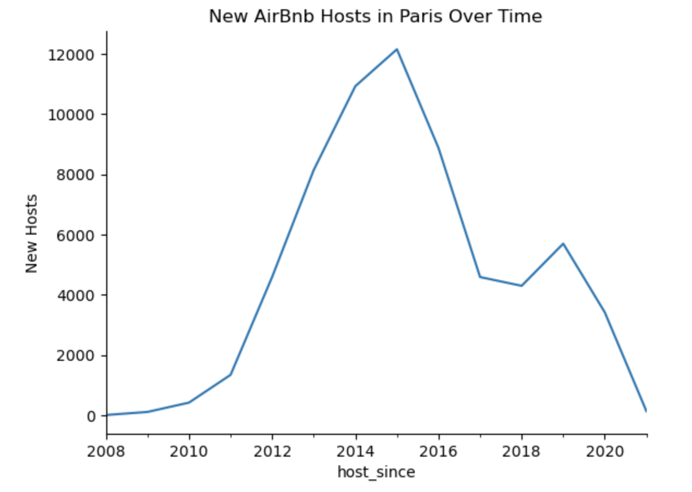
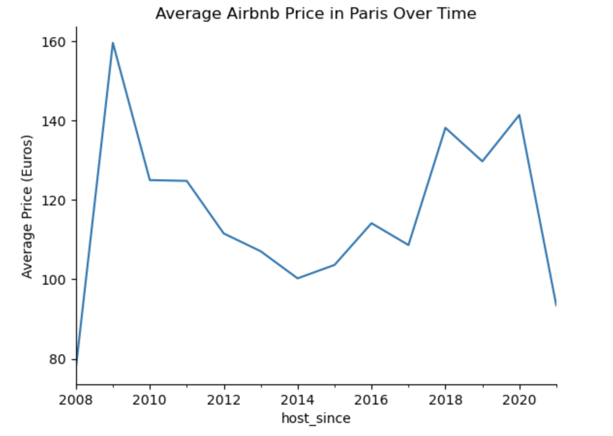
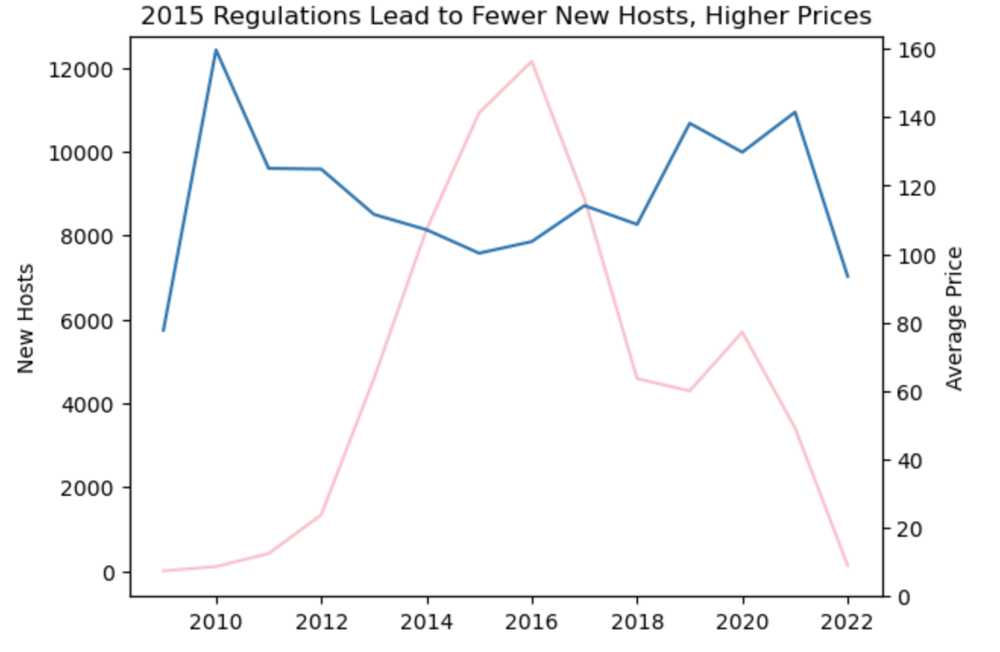

# AirBnB Listing Analysis
This project analyzes Airbnb listings in Paris to extract valuable insights using data analysis techniques.  
The goal is to filter, clean, and visualize the data to identify trends in pricing, accommodations, and host activity over time.  
Leadership wants a visual summary of factors affecting pricing  and whether regulations adopted in 2015 impacted listings    
in the Paris Market.  

🚀 **Guided Project by Maven Analytics**  
This project is part of a guided course from [Maven Analytics](https://www.mavenanalytics.io/). The dataset and project structure were provided, but all **data cleaning, analysis, and visualization were completed by me**.

## What I Learned
- Data cleaning & preparation using Pandas
- Aggregating and analyzing Airbnb listing data
- Data visualization using Matplotlib & Seaborn

## Technologies Used:
Python, Pandas, Matplotlib, Jupyter Notebook

## 🔥 Key Insights
### 🔹 Average Listing Price by Paris Neighbourhood
The graph below identifies **the most expensive and cheapest** neighbourhoods in Paris:

### 🔹 Average Listing Price by Accommodation Number
This graph shows **that price depends on accommodation capacity**:    

### 🔹 New Hosts Over Time
The graph below shows **the number of Airbnb new hosts in Paris** evolved over time between 2008 and 2021

### 🔹 Price Over Time
The graph below shows how **the average Airbnb prices in Paris** evolved over time, with a notable impact from **2015 regulations**.

### 🔹 2015 Regulations impact
The graph below shows the impact of **2015 regulations**, that leaded to fewer new hosts and higher prices.

### :bulb: Summary Insights 
📌 **Factors affecting pricing:**

Listings in Elysee, Louvre, and Champs-Élysées tend to have higher prices.
Entire homes/apartments cost significantly more than shared spaces.
More accommodations generally increase price.

📌 **Impact of 2015 regulations:**

Drop in new listings after 2015, indicating regulations affected new hosts.
Prices continued to increase post-2015, but fewer new hosts entered the market.
Some hosts possibly shifted to longer rental stays instead of short-term listings.
